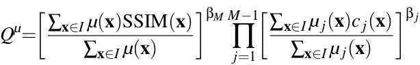

# Quality Metrics
### PSNR

PSNR metric has wide usage in the image processing literature, it is simple to compute and has clear physical meanings. However, this metric does not match well perceived visual quality, see the following examples.

Original image

JPEG compression (quality = 10%), PSNR = 28.1     

SSDMD compression, PSNR = 22.7

We see that the JPEG result with the quality setting of 10% is fuzzy, blocky, and has color quantization effects. Although SSDMD also looks possibly a bit fuzzy, it’s perceptually closer to the original image than the JPEG one. However, the PSNR value tells the opposite. So PSNR does not correspond well with perceived quality.

### Structural Similiarity Metrics

The structural similarity (SSIM) index measures, pixel-wise, how similar two images are by considering human perception. 
Multiscale SSIM (MS-SSIM) is an advanced top-down interpretation of how the human visual system interprets images that considers variations of image resolution and viewing conditions. Comprehensive evaluations have demonstrated that SSIM and MS-SSIM can offer statistically much better performance in assessing image quality than other quality metrics.

### Saliency-aware Quality Metric

While MS-SSIM models human perception well, it treats focus and context areas identically. Given this, saliency data should be (visually) considered in the quality metric so that the latter is more consistent with the human visual system. This is also reflected by saliency-based objective metrics reported in many papers. In these designs, a visual saliency map is integrated into the quality metric as a weighting map, which improves image quality prediction performance. We follow the same idea, by integrating the spatial saliency map into the MS-SSIM pooling function, as follows.

where c_j is the contrast map c(I,\tilde{I}) iteratively downsampled by a factor of 2 on scale 1 \leq j \leq M and \mathrm{SSIM}(I,\tilde{I}) is the structural similarity of I and \tilde{I} on scale M\,\cite{ssim}.  The exponent \beta_j models the relative importance of different scales. \mu_j is the saliency map at scale $j$. For notation brevity. Using Q^{\mu} instead of Q allows in-focus values to contribute more to similarity than context values, in line with our goal of spatially-controlled simplification.
