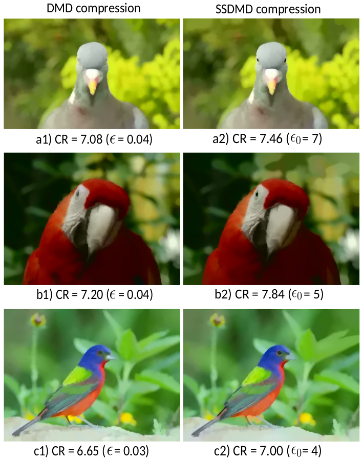
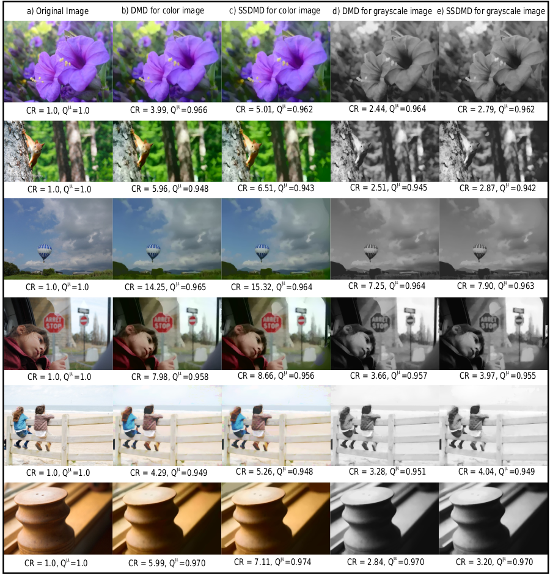
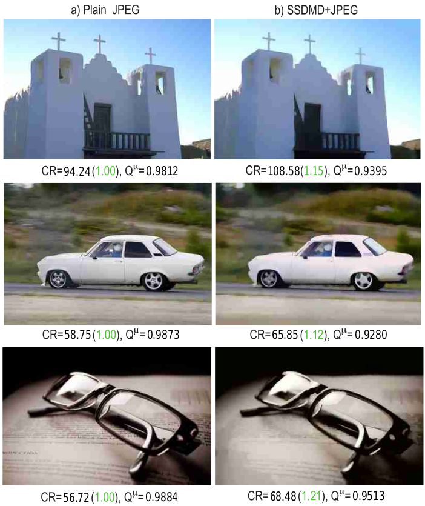

# Results

### **Increasing compression while retaining highlights**

This figure shows the simplification of three bird images by DMD (a1–c1) and SSDMD (a2–c2). Compared to DMD, SSDMD preserves the birds’ eyes while simplifying the background more, which allows it to achieve higher compression ratios while keeping perceptually salient features.

### **Increasing compression and/or quality**

This figure compares the DMD and the SSDMD method for color and grayscale versions of six real-world images (plant, animal, natural scene, people, and man-made structure) from the MSRA10K, SOD, and ECSSD benchmarks.  For each image, we show the compression ratio CR and quality
score. Both images and values in this figure show that the SSDMD method increases the compression ratio while maintaining perceived quality. 

### **JPEG preprocessor**

Another interesting use-case is to **combine** SSDMD's simplification ability with a generic image compressor. For this, we ran SSDMD as a preprocessor and subsequently compressed its result with standard JPEG. The above figure shows the results of plain JPEG compression at 20% quality setting and SSDMD+JPEG for the same quality setting for three images. Values in green are the CR of SSDMD+JPEG divided by plain JPEG's CR, i.e., the compression **gain** when using SSDMD as preprocessor for JPEG. This gain is 15%, 12% and 21% for the church, car, and spectacles image, respectively. For these images, the results using SSDMD+JPEG are visually almost identical in the focus areas (church building, car shape, and spectacles shape). Of course, in the context area (sky around church, scenery around car, book around spectacles) some differences are visible. This is expected and intended since, as explained, SSDMD aims to keep details in the focus area while simplifying them away in the context. In other words, for the same quality setting, SSDMD can **help** JPEG to increase compression rates for a minimal quality loss. This is explained by the fact that SSDMD removes small-scale sharp corners (which correspond to high frequencies in the image) in non-salient, background, image areas, thus making JPEG's job overall easier. 
